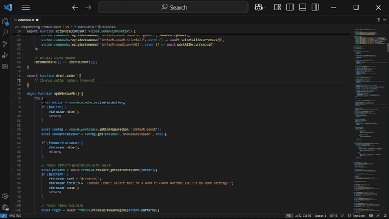
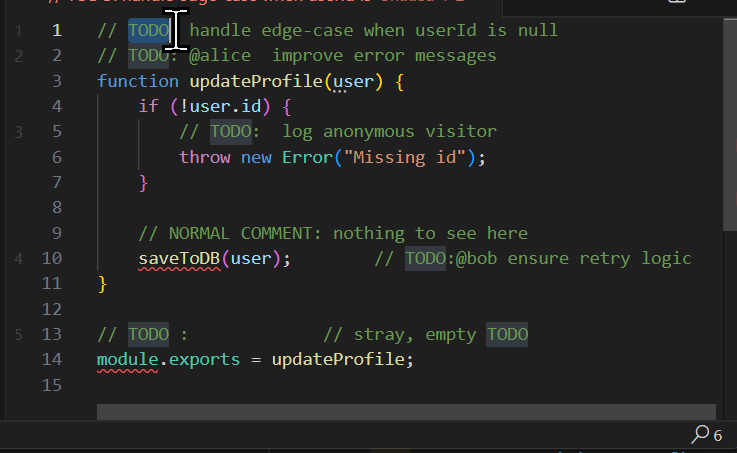
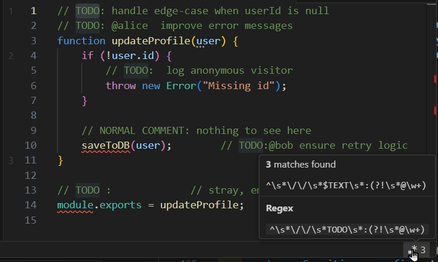

# Instant Count

> _Instantly count highlighted text, words, or fully-custom patterns – with live gutter badges, status-bar feedback, and one-click configuration._

---

## ✨ At a Glance
| Feature | What it does |
| :-- | :-- |
| **Real-time Counter** | Status-bar number updates as you type or select |
| **Numbered Badges** | Occurrence index drawn in the editor gutter |
| **One-click Panel** | Click the counter to toggle case/word/regex, enter rules, etc. |
| **Peek / Select-All** | View or multi-cursor-select every match in one command |
| **Custom Rules** | `$TEXT` / `$RAWTEXT` placeholders turn any selection into a regex |
| **Safe & Fast** | Chunked scanning, regex timeout guard, view-port badge rendering |

---

## 🚀 Quick Start
1. **Install** from the VS Code Marketplace: `instant-count`.  
2. **Select** text (or just place the cursor on a word).  
3. Watch the **status-bar counter** and **gutter badges** appear.  
4. Hit `Ctrl + Shift + R` to open the quick-config panel.

---

## 🔍 Advanced Regex Recipes

Below are four ready-to-paste rule examples in the same format used inside the extension.

**Example 1: Untranslated i18n Keys**  
- **Select:** `t(`  
- **Regex Rule:** `t\(\s*"(en\.)[^"]+"\s*\)`  
- **Result:** Flags `t("en.some.key")` calls still hard-coded to English.

**Example 2: Left-over `console.*` Calls**  
- **Select:** `console`  
- **Regex Rule:** `(^|\s)(console\.(log|debug|warn|error))\s*\(`  
- **Result:** Catches any `console.log`, `.debug`, `.warn`, `.error` still lurking in code.

**Example 3: Duplicate Words**  
- **Select:** `the` (or any word)  
- **Regex Rule:** `\b$TEXT\s+$TEXT\b`  
- **Result:** Finds “the the”, “return return”, etc., regardless of the word you pick.

**Example 4: JSX Components Missing a Prop**  
- **Select:** `MyButton`  
- **Regex Rule:** `<MyButton\b(?![^>]*\bonClick=)`  
- **Result:** Highlights every `<MyButton …>` with no `onClick=` prop.

### Custom Rule in Action

| Before | After |
|:--:|:--:|
|  |  |

---

## ⚙️ Configuration Reference

| Setting | Default | Description |
| :-- | :--: | :-- |
| `instant-count.caseSensitive` | `false` | Match case exactly |
| `instant-count.wholeWord` | `false` | Add `\b…\b` boundaries |
| `instant-count.useRegex` | `false` | Treat search pattern as regex |
| `instant-count.showGutterBadges` | `true` | Toggle numbered badges |
| `instant-count.showInStatusBar` | `true` | Toggle status-bar counter |
| `instant-count.regexRules` | `""` | Custom rule with `$TEXT` / `$RAWTEXT` |

_Open **Command Palette → “Instant Count: Settings”** for the interactive panel._

---

## ⌨️ Useful Commands

| Command | Keybinding | What it does |
| :-- | :--: | :-- |
| Toggle Case | none | Switch case sensitivity |
| Toggle Whole Word | none | Add/remove word boundaries |
| Toggle Regex Mode | none | Literal ↔ regex |
| Peek All Matches | `Ctrl + Shift + 3` | Open VS Code peek panel |
| Select All Matches | `Ctrl + Shift + Alt + S` | Multi-cursor select |

---

## 🛡 Performance & Safety

* Chunked scanning keeps UI fluid even on **10 MB+** files.  
* Regex execution has a **500 ms timeout guard** to avoid catastrophic back-tracking freezes.  
* Badges are only rendered inside (and near) the view-port for zero scroll-lag.

---

## 🤝 Contributing

1. Fork the repo, `npm install`, press **F5** to launch the *Extension Host*.  
2. Submit pull-requests against the `dev` branch.  
3. All contributions are released under the MIT license.

---

## 📜 License

[MIT](LICENSE) © 2025 Ali Do

## 🤝 Contributing

PRs are welcome!  
1. Fork the repo · 2. `npm install` · 3. Press **F5** to launch the Extension Host · 4. Submit a pull-request to `main`.

## 🚀 Install

---

> _Made with ♥ and a lot of regex._
